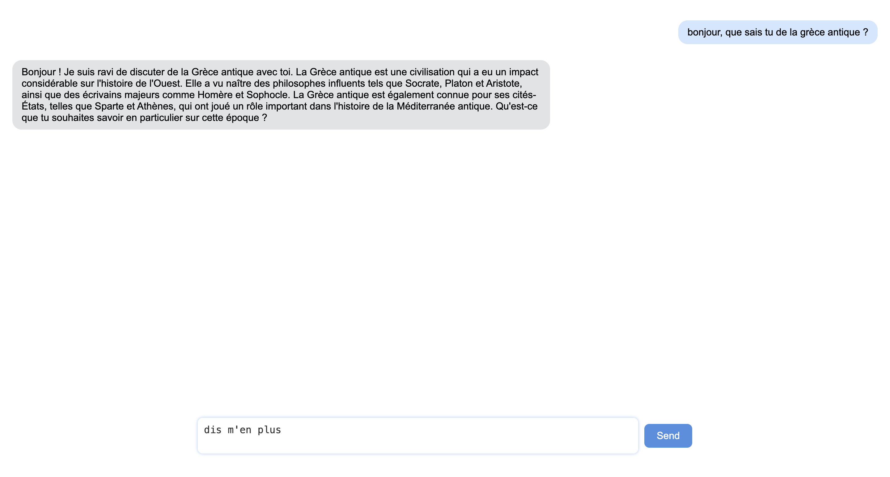

# LLMChat

It's a minimalist application to test your LLM.



## Installation

Change values inside `src/settings.ts` to match your configuration.

Then :

```bash
npm i && npm run start
```

## API Example

You can find an api example code at `api_example/main.py`.

Framework used is [raglight](https://pypi.org/project/raglight/).

```bash
python main.py
```
